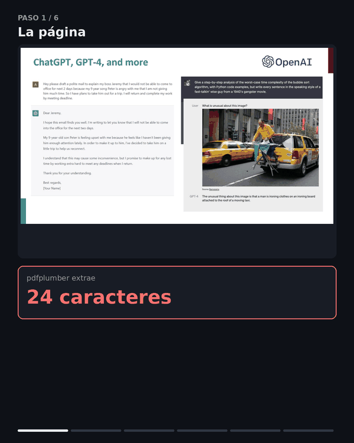

# ¿Cuándo merece la pena el OCR en un pipeline de RAG?

Casi todos los tutoriales de RAG sobre PDF empiezan igual: extraer el texto con
`pdfplumber` o PyMuPDF, trocear, indexar. Y casi todos añaden, como nota al pie, que
si el PDF es un escaneo "habrá que meter OCR". Nadie dice **cuándo**.

Este repositorio responde a esa pregunta midiendo, no opinando. Perfila 2.382 páginas
de 13 documentos públicos, compara políticas de triaje y termina evaluando qué le pasa
a un RAG cuando se le quita el OCR.

El resultado corto: **el OCR selectivo no depende de si el documento es académico u
oficial, sino de si el contenido está rasterizado**. En un informe maquetado no aporta
absolutamente nada. En diapositivas de clase decide si el sistema puede responder o no.

## Los tres resultados

### 1. El umbral de caracteres, el número mágico que nadie mide

La regla habitual es "si la página tiene menos de N caracteres nativos, pásale OCR".
Con distintos valores de N sobre el mismo corpus:

| Política | Págs a OCR | % del corpus | En blanco | Con ganancia real | Precisión |
|---|---:|---:|---:|---:|---:|
| `native_chars < 10` | 11 | 0,5 % | 8 | 1 | 9 % |
| `native_chars < 80` | 48 | 2,0 % | 21 | 10 | 21 % |
| `native_chars < 1000` | 929 | 39,0 % | 21 | 26 | 3 % |
| **medido** | **75** | **3,1 %** | **0** | **26** | **35 %** |

Los tres primeros son umbrales reales que yo mismo tenía escritos en tres sitios
distintos del mismo proyecto, sin ninguna medición detrás.

La política `medido` exige tres condiciones en vez de una: poco texto nativo, **tinta
en el render** y **al menos una imagen embebida**. Encuentra las mismas 26 páginas
útiles que el umbral de 1000 llamando al OCR **12 veces menos**, y sin renderizar ni
una sola página en blanco.

Las dos señales nuevas atacan cada una un modo de fallo:

- `ink_coverage` descarta folios vacíos. Un umbral de 10 caracteres dispara 11 veces
  en este corpus y 8 son páginas literalmente en blanco.
- `n_images` distingue "texto vectorial escaso" de "contenido dentro de una imagen".
  Sin ella se manda a OCR portadillas cuyo titular `pdfplumber` ya había leído.

### 2. Lo que decide el resultado es cómo se fabricó el PDF

Mismo código, mismo umbral, cuatro tipos de documento:

| Corpus | Págs | A OCR | Nativo → OCR | Págs con ganancia |
|---|---:|---:|---:|---:|
| IPCC AR4 (ES) + manual de R | 217 | 2,8 % | **×1,0** | 0 |
| Manual de QGIS | 1.645 | 1,2 % | ×4,6 | 14 |
| Diapositivas Stanford CS224n/CS231n | 438 | 19,2 % | ×1,6 | 12 |

En documentos generados desde LaTeX o desde un maquetador, el OCR reproduce
exactamente lo que ya había: ×1,0. En manuales con capturas de pantalla y en
transparencias de clase, recupera contenido que de otro modo no existe.

El ejemplo canónico está en `out/figuras/`: la diapositiva 15 de CS224n Lecture 1 se
titula *"ChatGPT, GPT-4, and more"* y es entera capturas de conversaciones.
`pdfplumber` extrae **24 caracteres** — el título. El OCR extrae **1.206**.

### 3. Sin OCR el RAG no responde

Ocho preguntas cuya respuesta vive dentro de una imagen: una tabla de perplejidad, los
tiempos de inferencia de Faster R-CNN, el número de parámetros de Switch-C. Mismo
corpus, mismo retriever, mismos chunks salvo los que aporta el OCR:

| Índice | Chunks | Recall@5 |
|---|---:|---:|
| Solo texto nativo | 410 | **0,00** (0/8) |
| Híbrido con OCR | 440 | **0,88** (7/8) |

**Un 7 % más de chunks convierte un sistema que no responde nada en uno que responde
siete de ocho.** Ese 7 % es justo lo que el triaje decide, y por eso el triaje importa.

## Un cuarto hallazgo: el OCR también estropea

El reconocedor pierde los espacios en capturas con tipografía apretada y devuelve
`Ihopethisemailfindsyouwell`. Indexar eso produce un embedding sin relación con el
texto real. `scripts/ocr_normalize.py` los reconstruye con programación dinámica sobre
un vocabulario que **sale del propio corpus**: las páginas de texto nativo del mismo
documento ya están bien segmentadas y sirven de diccionario de dominio, con una lista
de palabras general como respaldo.

```
antes : thisimageisthatamanisironingclothesonanironingboard
ahora : this image is that a man is ironing clothes on an ironing board
```

## Y un problema que este triaje no resuelve

El corpus incluye tres Gacetas de Madrid (1750, 1885 y 1936). El BOE ya les ha pasado
OCR, así que traen capa de texto —12.818 caracteres de media por página en la edición de
1885— y **no disparan a ningún umbral**. Pero esa capa está corrupta:

```
Vierta 6. de Diciembre de i 749      (era: Viernes)
paííáron fusMageftades                (la ſ larga leída como f)
continúan en esta CiOrtí ^ o /edad    (era: en esta Corte sin novedad)
```

El triaje mide **cantidad** de texto y el problema es de **calidad**. Probé dos
detectores baratos y los dos fallan: la tasa de *stopwords* y un modelo de n-gramas de
caracteres puntúan *Attention Is All You Need* como el peor texto del corpus, siendo
impecable, porque confunden idioma y dominio con calidad de extracción.

La vía que sí funciona es usar el OCR como árbitro: renderizar la página, pasarle OCR
y comparar con la capa de texto. Si las dos lecturas discrepan mucho, una está mal.
Está pendiente de implementar.

## Ver el pipeline funcionando

`scripts/viz_animation.py` genera una animación de 18 segundos que recorre el pipeline
entero sobre una página real: detección de cajas, reconocimiento, reconstrucción de
espacios, chunking con procedencia y recuperación final.



Los seis pasos están también como láminas sueltas en `out/figuras/paso_*.png`, y
agrupados en `pipeline_laminas.pdf` para leerlos con calma. Todas las visualizaciones se
generan desde el resultado cacheado del OCR, así que no hay números escritos a mano:
cada cifra que aparece sale de los ficheros de medición.

```bash
python scripts/cache_ocr.py --pdf data/pdf/cs224n_l01.pdf --page 15 --out-dir out/cache
PYTHONPATH=scripts python scripts/viz_animation.py
PYTHONPATH=scripts python scripts/viz_contraste.py
PYTHONPATH=scripts python scripts/viz_capa_corrupta.py
```

## Cómo reproducirlo

```bash
pip install -r requirements.txt
python scripts/fetch_corpus.py                     # descarga los 13 PDF y su manifiesto
python scripts/page_profile.py --pdf data/pdf/cs224n_l01.pdf \
       --doc-id cs224n_l01 --out out/profiles/cs224n_l01.jsonl
python scripts/triage.py --profiles "out/profiles/*.jsonl"
python scripts/extract_corpus.py --pdf data/pdf/cs224n_l01.pdf \
       --profile out/profiles/cs224n_l01.jsonl --out out/pages/cs224n_l01.jsonl
python scripts/rag_eval.py
```

Los PDF **no se versionan**: pertenecen a sus autores y aquí solo se usan como material
de medida. `scripts/fetch_corpus.py` los descarga de su fuente original y registra el
SHA-256 de cada uno.

## Los scripts

| Script | Qué hace |
|---|---|
| `fetch_corpus.py` | Descarga el corpus y escribe el manifiesto con hashes |
| `page_profile.py` | Perfila cada página: caracteres nativos, imágenes, tinta, señales de calidad |
| `triage.py` | Define y compara políticas de triaje sobre los perfiles |
| `ocr_yield.py` | Mide cuánto texto añade realmente el OCR en las páginas que dispara |
| `hybrid_pdf_extract.py` | Extracción híbrida página a página con RapidOCR |
| `ocr_normalize.py` | Reconstruye los espacios que el OCR pierde |
| `extract_corpus.py` | Aplica la política medida y emite el texto con su procedencia |
| `rag_eval.py` | Construye los dos índices y mide el impacto del OCR sobre el recall |
| `make_figure.py` | Figura antes/después de una página, en formato ancho |
| `cache_ocr.py` | Cachea render, cajas de detección y texto de una página |
| `viz_common.py` | Paleta, tipografía y primitivas de las visualizaciones |
| `viz_animation.py` | Animación del pipeline completo, en GIF y MP4 |
| `viz_contraste.py` | Lámina del contraste pdfplumber contra OCR |
| `viz_capa_corrupta.py` | Lámina de la capa de texto corrupta |
| `viz_laminas_pdf.py` | Agrupa las láminas en un único PDF |
| `viz_portada.py` | Portada de la animación con el contraste principal |

Cada página extraída conserva su procedencia (`PLUMBER`, `OCR` o `EMPTY`), la
confianza del OCR y las señales que motivaron la decisión. Sin ese rastro no se puede
auditar por qué el RAG respondió lo que respondió.

## Corpus

13 documentos públicos, 2.382 páginas, agrupados por cómo se fabricaron:

- **Maquetado**: IPCC AR4 síntesis (ES), Constitución Española (BOE), *Attention Is All
  You Need*, *An Introduction to R*.
- **Manual con capturas**: QGIS 3.40 Desktop User Guide.
- **Capa de OCR ajena**: Gaceta de Madrid de 1750, 1885 y 1936.
- **Diapositivas**: Stanford CS224n lectures 1 y 8, CS231n lectures 5, 9 y 11.

Las fuentes exactas están en `corpus/corpus.json`.
